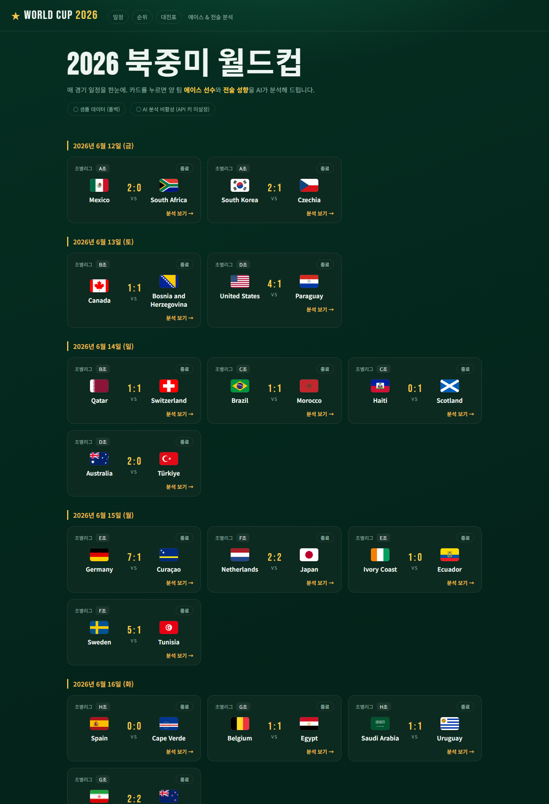
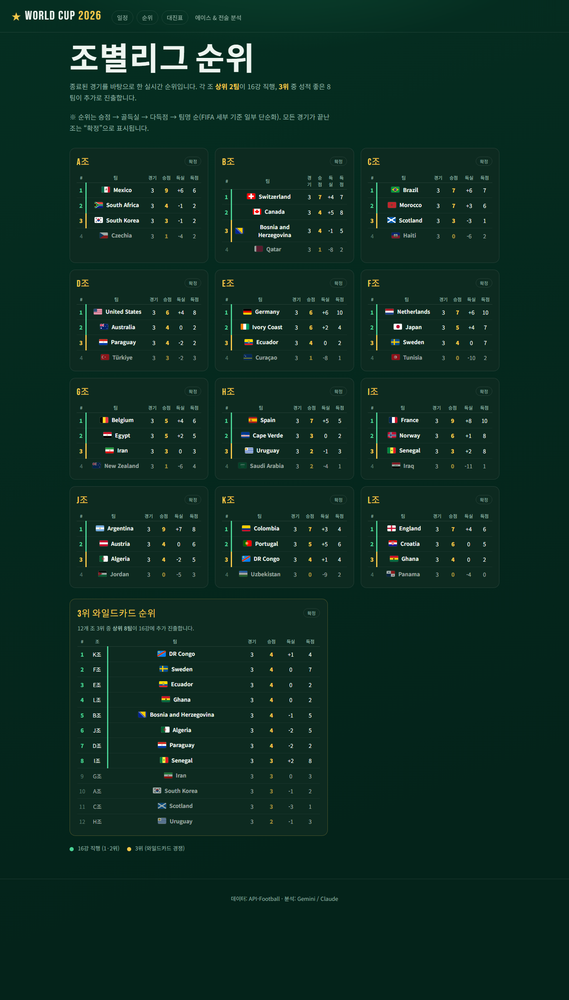
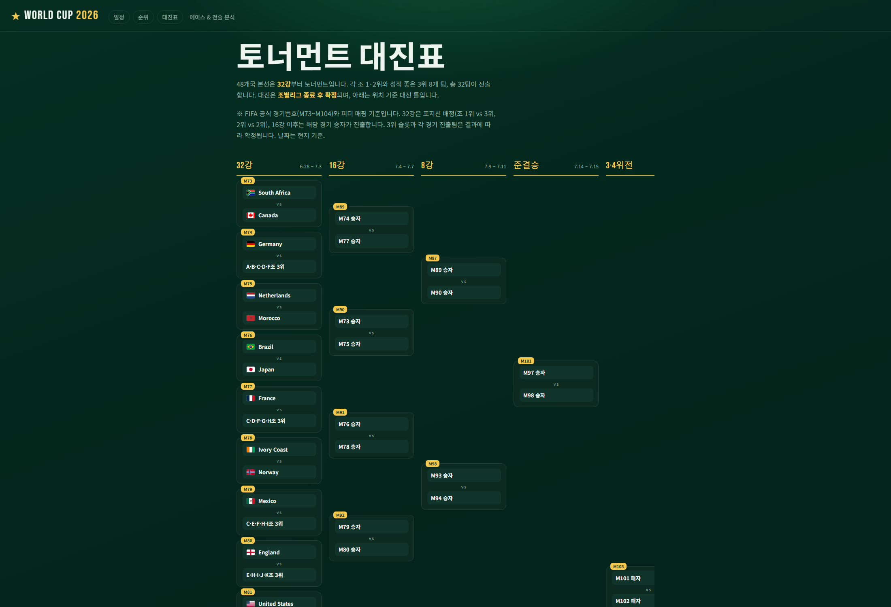
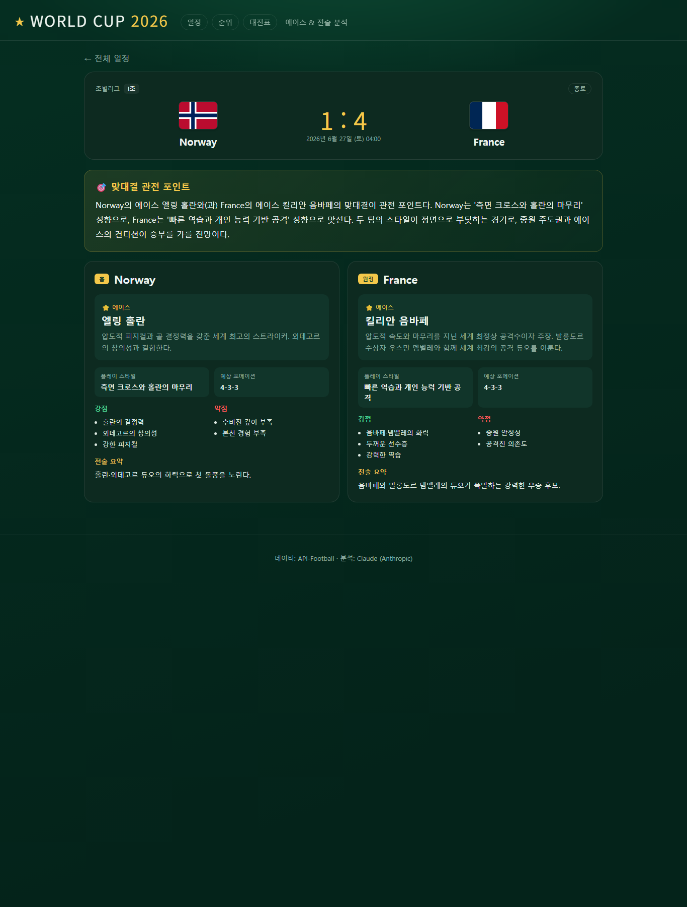

# WorldCupAnalysis ⚽


[](https://github.com/junse02/WorldCupAnalysis/commits/main)


2026 북중미 월드컵 경기 일정을 가져와 각 팀의 **에이스 선수**와 **전술 성향**을 AI로 분석해 주는
Spring Boot + Thymeleaf 웹사이트입니다.

- **데이터**: [API-Football](https://www.api-football.com/) (api-sports.io) v3 `/fixtures` (World Cup = `league=1`)
- **분석**: AI 생성 (구조화 JSON 출력). 우선순위 **Gemini(`gemini-2.5-flash`) → Claude(`claude-opus-4-8`) → 큐레이션 정적 데이터**
- **화면**: Thymeleaf 서버 렌더링

API 키가 없어도 **번들 샘플 데이터**와 **자리표시자 분석**으로 사이트가 그대로 동작합니다.

## 화면 미리보기

| 경기 일정 (홈) | 조별리그 순위 |
|:---:|:---:|
| [](docs/screenshots/home.png) | [](docs/screenshots/standings.png) |

**토너먼트 대진표** — 32강~결승 대진 틀. 조별리그 종료로 확정된 팀은 **국기**와 함께 표시됩니다.

[](docs/screenshots/bracket.png)

**경기 분석** — 양 팀 에이스·강점/약점·포메이션·전술 요약과 맞대결 관전 포인트

[](docs/screenshots/match.png)

> 모든 국가는 **국기 이미지**(일정·순위·대진표·경기 상세)와 함께 표시됩니다. API-Football 크레스트가 없을 때는
> [flagcdn](https://flagcdn.com) 국기로 폴백합니다. 위 화면은 API 키 없이 번들 샘플 데이터(2026 조별리그
> 72경기 실제 결과)로 렌더링한 모습입니다.

## 실행

```bash
# 모든 키는 선택 사항 — 없으면 샘플/정적 데이터로 동작
export APIFOOTBALL_API_KEY=...   # api-sports.io (API-Football) 키 — 일정 데이터
export GEMINI_API_KEY=...        # Google Gemini 키 — AI 분석 (우선)
export ANTHROPIC_API_KEY=...     # Anthropic 키 — AI 분석 (Gemini 미설정 시)

./gradlew bootRun
```

Windows PowerShell:

```powershell
$env:APIFOOTBALL_API_KEY = "..."
$env:GEMINI_API_KEY = "..."
.\gradlew.bat bootRun --no-daemon   # --no-daemon: 데몬이 환경변수를 캐시하는 문제 회피
```

> **시즌 주의**: API-Football *무료* 플랜은 2022~2024 시즌만 접근됩니다. 실제 2026 월드컵
> 데이터는 유료 플랜이 필요합니다. `application.properties`의 `apifootball.season` 기본값은
> **2022**(카타르)이며, 무료 키로 실제 데이터를 바로 확인할 수 있습니다. 플랜이 지원되면
> `apifootball.season=2026`으로 바꾸세요.

브라우저에서 <http://localhost:8080> 접속.

- `/` — 날짜별 경기 일정 (조별리그/토너먼트 단계, 스코어/킥오프, 경기 상태)
- `/matches/{id}` — 양 팀 에이스·강점/약점·포메이션·전술 요약 + 맞대결 관전 포인트

## 구조

```
client/ApiFootballClient     API-Football 호출·정규화 (+ 샘플 데이터 폴백, 실시간/폴백 출처 추적)
service/MatchService        경기 조회·캐싱, 화면용 MatchView 변환(KST·한국어 라벨)
client/GeminiClient          Gemini 호출(팀 분석 JSON 스키마, 맞대결 프리뷰) — REST 직접 호출
service/AnalysisService     AI 분석 오케스트레이션(Gemini→Claude→정적) + 캐싱
service/StaticAnalysisStore  큐레이션 정적 분석 로딩(폴백)
controller/WorldCupController  /, /matches/{id}, /bracket, /standings 라우팅
service/StandingsService     조별 순위 계산(승점·득실·다득점) + 대진표 슬롯 치환
service/BracketService       32강~결승 토너먼트 대진 틀(공식 M73~M104 피더, 확정 슬롯 자동 치환)
model/                      football-data DTO, TeamAnalysis(분석 스키마), MatchView
config/CacheConfig          in-memory 캐시 (분석 결과 재사용 → API 비용 절감)
resources/templates/        index.html, match.html, fragments/
resources/sample/           wc-matches.json (API 미연동 시 폴백 데이터)
```

## 동작 메모

- **캐싱**: 팀 분석/맞대결 프리뷰는 캐시되어 페이지를 새로고침해도 Claude를 다시 호출하지 않습니다.
  경기 일정 캐시는 10분마다 갱신됩니다(스코어 반영).
- **폴백**: API-Football 키가 없거나 호출이 실패/0건이면 `sample/wc-matches.json`을 사용합니다.
  Anthropic 키가 없으면(또는 호출 실패 시) 48개 본선 팀의 **큐레이션된 정적 분석**
  (`sample/team-analysis.json`, 에이스·전술 성향)을 사용합니다. 키가 있으면 Claude가 실시간 생성합니다.
- **출처 표시**: 홈 상단 배지가 실제 호출 성공 여부를 반영합니다 — "실시간 데이터 (API-Football)"
  또는 "샘플 데이터 (폴백)". 키가 있어도 플랜·시즌 제한으로 0건이면 폴백으로 표시됩니다.
